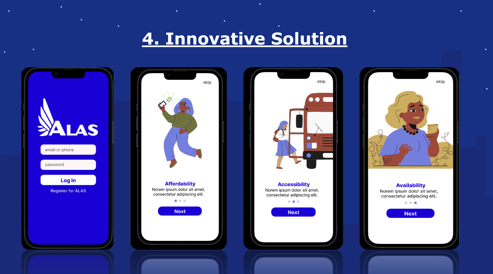
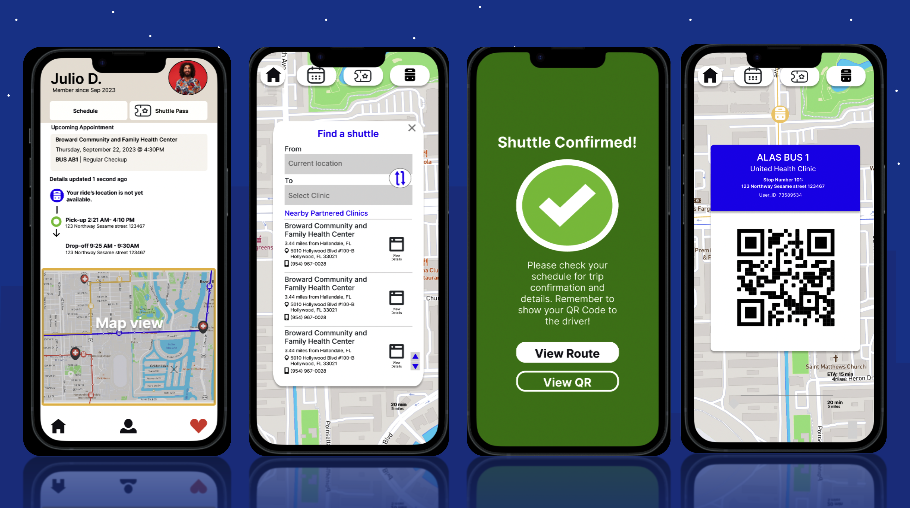
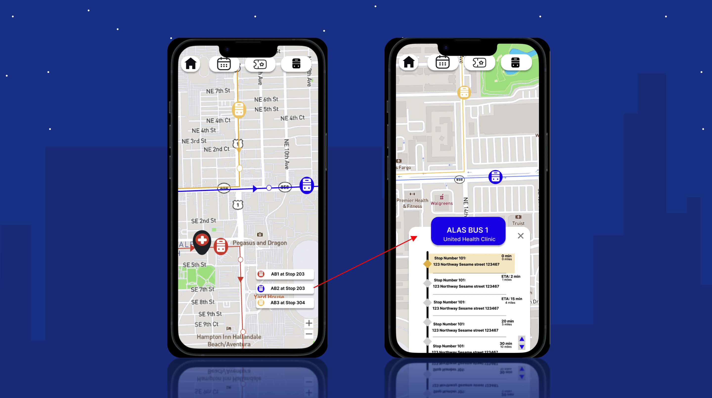
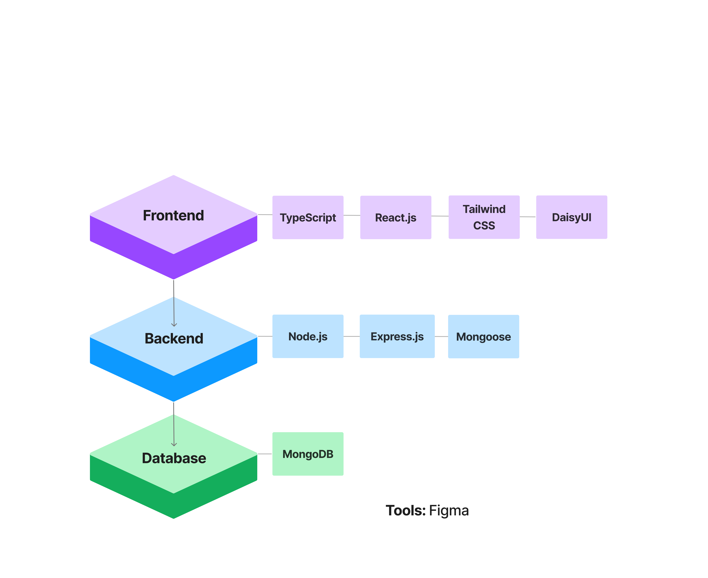

# ALAS - An Inclusive Shuttle Service <!-- omit in toc -->

> A business solution aimed to increase accessibility to healthcare within underrepresented communities.

**Project Objective:** To provide free transportation to medical clinics for low-income Hispanic communities, aligning with KPMG's commitment to diversity, equity, and inclusivity in healthcare access.

## Table of Contents

- [Wireframes](#wireframes)
- [Demo Video](#demo-video)
- [Tech Stack](#tech-stack-mern)
- [Executive Summary (Proposal)](#executive-summary)
- [Usage (Local)](#usage-local)

## Wireframes

> **Figma Session:** <https://www.figma.com/file/y3fxb45cuXF6sFzeXSgcS7/HSI-Battle-of-the-Brain-09%2F21?type=design&node-id=0%3A1&mode=design&t=1dTg2p4Gkhs8TsAF-1>

### Sign up

### Reserve Rides

## View Routes

## Demo Video

## Tech Stack (MERN)

## Executive Summary

### Table of Contents <!-- omit in toc -->

- [Introduction](#introduction)
- [Business Description](#business-description)
  - [Service Offering](#service-offering)
  - [Partnership Structure](#partnership-structure)
- [Market Opportunity](#market-opportunity)
  - [Addressing A Critical Need](#addressing-a-critical-need)
  - [Projected Growth](#projected-growth)
    - [Year 1 Projection(s):](#year-1-projections)
    - [Year 3 Projection(s):](#year-3-projections)
- [Strategic Benefits](#strategic-benefits)
  - [Corporate Reputation](#corporate-reputation)
  - [Client Engagement](#client-engagement)
- [Conclusion](#conclusion)

## Introduction

In collaboration with Transdev, KPMG is proud to introduce Project Alas, an innovative and socially responsible shuttle service dedicated to improving healthcare access for underserved Hispanic communities.

Alas aims to tackle transportation barriers, thereby increasing access to preventative care and early diagnosis, particularly for Hispanic families facing transit challenges.

**Partners:** KPMG and Transdev

**Project Objective:** To provide free transportation to medical clinics for low-income Hispanic communities, aligning with KPMG's commitment to diversity, equity, and inclusivity in healthcare access.

## Business Description

### Service Offering

- **Neighborhood Shuttles:** Alas will operate shuttle services to clinics and health centers across the city, directly addressing the transportation gap in underserved communities.
- **Ease of Access:** Riders will have the option to register online or by phone, receiving an ID card or a digital QR code for seat reservations.
- **Operational Hours:** Shuttles will operate five days a week, aligned with clinic hours, ensuring accessibility when needed.

### Partnership Structure

KPMG will sponsor the operational costs of Alas, demonstrating its commitment to social responsibility and healthcare equity. Transdev, a trusted transportation solutions provider, will supply vehicles, experienced drivers, and routing expertise.

## Market Opportunity

### Addressing A Critical Need

- Alas fills a significant gap in the market by providing free transportation to medical clinics, directly addressing social determinants of health.
- The service is poised to serve an underserved population, predominantly Hispanic communities, who face transportation barriers.

### Projected Growth

#### Year 1 Projection(s):

- Alas is expected to provide over 5,000 rides per month, addressing the immediate need for affordable and accessible healthcare transportation.

#### Year 3 Projection(s):

- By Year 3, we aim to expand our services to other underserved communities in the city, further enhancing our social impact.

## Strategic Benefits

### Corporate Reputation

- KPMG's partnership with Transdev for Project Alas enhances its reputation as a socially responsible organization committed to diversity, equity, and inclusivity.

### Client Engagement

- Demonstrating KPMG's commitment to community health will strengthen client relationships, showcasing our values and dedication beyond traditional business boundaries.

## Conclusion

Project Alas is more than a transportation service; it's a commitment to equity, empathy, and empowerment in community healthcare. By addressing transportation barriers, we are fostering a healthier, more inclusive future. Alas provides a pioneering model for corporate-sponsored transportation initiatives focused on social determinants of health. Together, KPMG and Transdev are changing lives and transforming healthcare access for underrepresented low-income communities. We invite you to join us on this remarkable journey towards a more equitable and inclusive future.

## Usage (Local)

> **Note:** keep in mind the folders `/server` and `/client`, you will have to go into both of them since this's a fullstack web app built with `Vite`.
>
> If you wish to fully run the _backend_ you will need to MongoDB Atlas credentials. All you need is basic database with two collections: `emails` and `users`. However, this is NOT needed to see the basic functionality of the app.

1. **Run the backend/server**
   1. Open a new terminal instance
   2. Go into the `/server` folder: `cd server`
   3. Rename `.env.template` to `.env` and place all credentials
   4. Install dependencies: `npm install`
   5. Start the backend: `npm run start`
2. **Run the frotend/client**
   1. Open _another_ terminal window (keep the first running)
   2. Go into the `/client` folder: `cd client`
   3. Install dependencies: `npm install`
   4. Start the frontend: `npm run dev`
3. **Login credentials:** For the sake of opening the repo, there is an override. No need to give any credentials within "Login" screen
